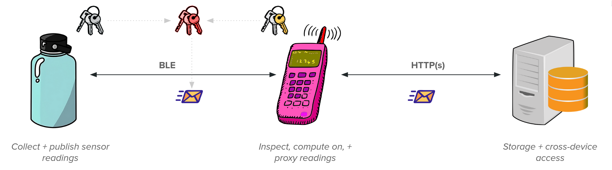
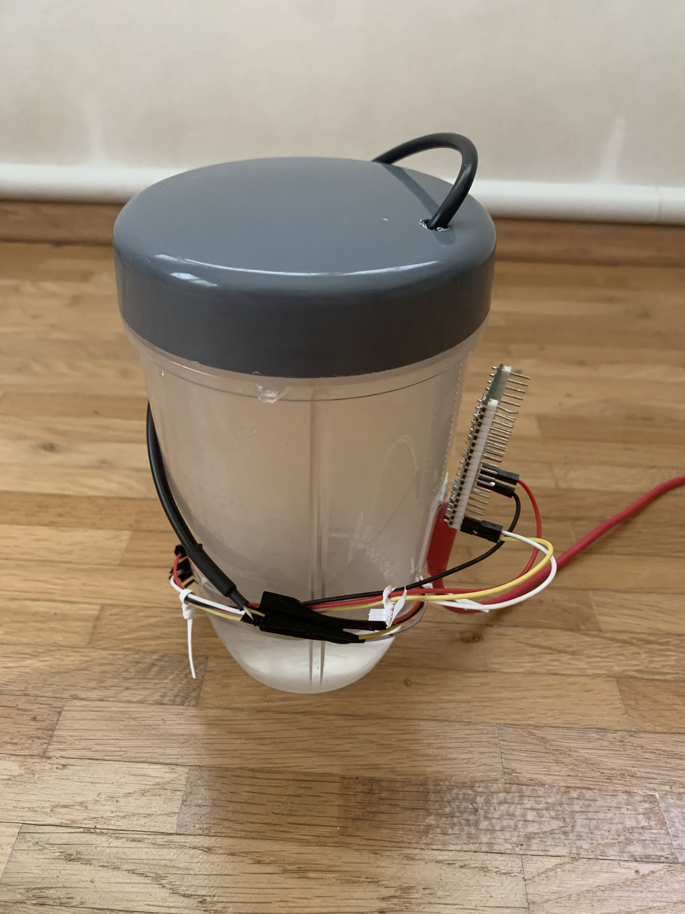

Smart Water Bottle
==================

A "smart" water bottle developed in the context of an IoT security course, designed for a Raspberry Pi Pico 2W.



This project proposes a smart water bottle which communicates its current capacity to the user's device over BLE, allowing the user to track and monitor the bottle's current fill-level, thus enabling them to get notified when they should drink, view their past and current drinking statistics from multiple devices via a cloud-based API service, or similar. Specifically, the user's smartphone (or any Bluetooth-capable device) acts as a mobile gateway and client alike. As the bottle will theoretically be taken outdoors to places where it cannot establish a consistent WiFi connection to a static hub, this ensures that it can continually post readings to the API server using the user's device as a proxy.

Bill of Materials
=================

-	A Raspberry Pi Pico 2W
-	A02YYUW ultrasonic depth sensor
-	A laptop/BLE client to act as a gateway
-	A cup/container that you are willing to sacrifice, e.g drill a hole into (see example construction below)

Building & Running
------------------

Before compiling the client code/firmware, ensure that you have generated keypairs for both parties via `make generate`. Note also that (by the grace of the TinyGo framework) it may be possible for the firmware to work for alternative MCUs, though no guarantees can be made w/r/t this statement. The target board can be overwritten by setting the `TARGET` variable respectively before running firmware-related make targets. Consult the [TinyGo documentation](https://tinygo.org/docs/) for all available compilation targets.

```bash
# Generate crypto material
make generate

# Compile firmware (UF2)
make build-uf2

# Build desktop GUI client
make build-client
```

Then, ensure that the backend is running.

```bash
python3 -m venv .venv && \
    source .venv/bin/activate && \
    pip3 install -r requirements.txt

cd backend && fastapi run main.py
```

Example Construction
====================



License
=======

This project is licensed under the terms of the [MIT license](./LICENSE).
